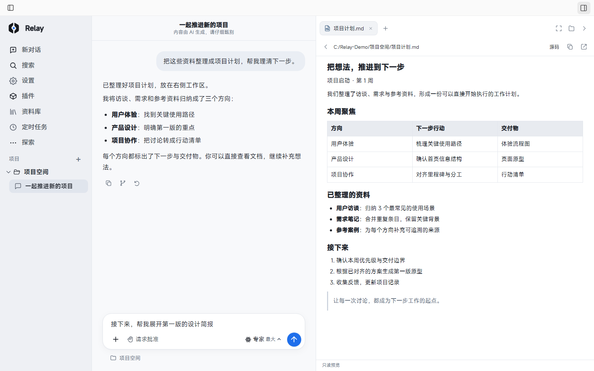
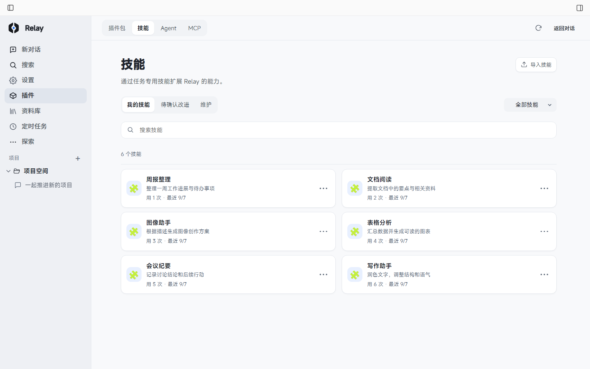
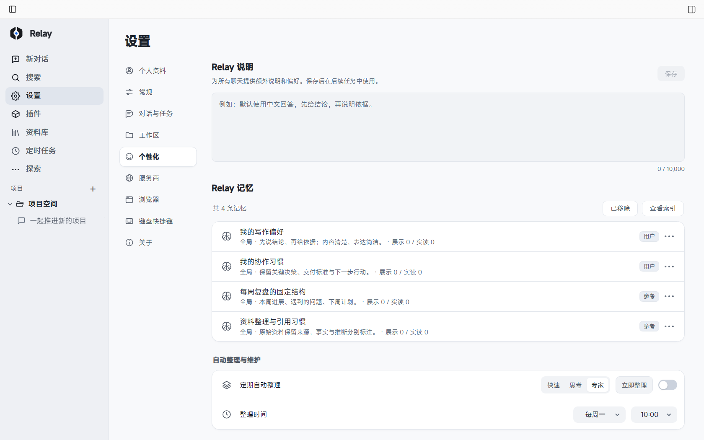
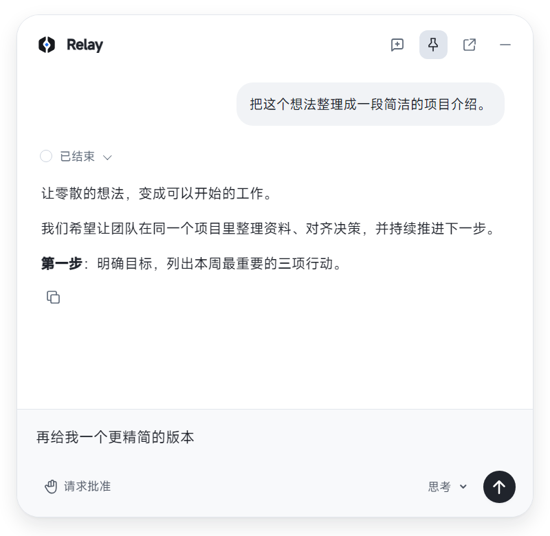

<p align="center">
  <picture>
    <source media="(prefers-color-scheme: dark)" srcset="renderer/logo-dark.svg">
    
  </picture>
</p>

<h1 align="center">Relay</h1>
<p align="center"><strong>把对话，变成桌面上的交付。</strong></p>
<p align="center">面向 Windows 的 AI 工作区。连接模型与工具，在一个窗口里处理项目、文档、网页和代码。</p>

<p align="center">
  <a href="LICENSE">Apache-2.0</a> · Windows x64 · Electron · Claude Agent SDK
</p>
<p align="center">
  <a href="#开始使用">下载安装</a> ·
  <a href="#一个窗口完成一项工作">功能一览</a> ·
  <a href="#本地开发">本地开发</a> ·
  <a href="CONTRIBUTING.md">参与贡献</a>
</p>

<picture>
  <source media="(prefers-color-scheme: dark)" srcset="assets/readme/workspace-dark.png">
  
</picture>

<p align="center"><sub>当前代码的真实界面，使用合成演示数据；不代表真实模型执行结果。<a href="assets/readme/README.md">截图来源与复现</a></sub></p>

| 从需求到文件 | 工作过程可见 | 按你的方式工作 |
| --- | --- | --- |
| 选择项目，整理资料、编写脚本、生成文档，再直接打开交付物。 | 查看工具调用与进度，补充要求、处理审批、暂停任务。 | 配置服务商与模型，通过技能、Agent、MCP 和记忆扩展能力。 |

## 开始使用

### 1. 安装 Relay

当前提供 **Windows x64** 安装包。

**现在可下载：[Relay 3.0.1](https://github.com/g1at/Relay/releases/tag/v3.0.1)**。安装后，在设置中配置自己的服务商和 API Key；Relay 本身不要求注册账号，模型调用由对应服务商计费。

> **3.0.1 为更新源迁移版本。** 本仓库与 [relay-updates](https://github.com/g1at/relay-updates/releases/tag/v3.0.1) 提供同一份安装包，作为旧仓库最后一个版本；升级后，后续更新转到本仓库。具体改进见 [3.0.1 更新说明](https://github.com/g1at/Relay/releases/tag/v3.0.1)。

<details>
<summary>下载与命令行安装入口</summary>

可从 [本仓库 Releases](https://github.com/g1at/Relay/releases) 下载，或在 PowerShell 5.1 / 7 中执行：

```powershell
& ([scriptblock]::Create((irm 'https://raw.githubusercontent.com/g1at/Relay/main/distribution/install.ps1')))
```

安装脚本会校验下载文件；识别到登记完整的已有安装时，沿原目录与范围升级，已是最新版则跳过。安装前请退出 Relay，包括托盘实例。

仅下载、指定版本与安装向导选项见 [命令行安装说明](distribution/README.md)。维护者发布步骤见 [发布指南](distribution/PUBLISHING.md)。

</details>

### 2. 连接模型，选择项目

1. 在 **设置 → 服务商** 添加服务地址、API Key 和可用模型，配置对话模型档位。
2. 添加本地文件夹作为项目；也可以直接使用默认的 `RelayProjects` 工作区。
3. 输入需求，按任务需要附加文件、选择技能或 Agent，并设置权限模式。
4. 在右侧工作区检查结果，继续追问或修改。

例如，先从一项有明确交付物的小任务开始：

> 阅读项目中的资料，整理成一份中文项目计划，包含目标、里程碑和待确认事项，保存为 `项目计划.md`。

对话服务需要兼容 Anthropic 接口及所需工具能力。安装包包含 SDK 运行时，无需预先手动安装 Claude Code CLI；使用 WSL 执行环境时，需要自行准备可用的 WSL 发行版。

## 一个窗口，完成一项工作

### 项目、文件、终端，就在对话旁边

围绕本地项目开展工作，回复里的文件可以继续在右侧打开。调整侧栏宽度，在讨论和检查交付物之间切换。

| 工作区 | 可以做什么 |
| --- | --- |
| **文件** | 浏览目录树，查看源码、Markdown、图片与 HTML，打开回复中的本地文件链接。 |
| **终端** | 在项目目录创建独立终端标签，运行和调试交付物。 |
| **浏览器** | 浏览网页、预览本地 HTML，使用多标签、历史、书签、下载与开发者工具。 |
| **审查** | 在 Git 项目中查看未暂存、已暂存和新增文件的变更。 |

### 长任务进行中，仍然能交流

- **过程可见**：思考、工具调用、阶段性输出与最终回答集中展示，长内容可以折叠。
- **中途跟进**：补充要求可按设置尽快跟进或加入队列，也可以暂停后继续。
- **计划与目标**：从输入框 `+` 菜单进入对应模式；目标能力取决于当前 SDK 运行时支持。
- **权限控制**：选择「请求批准 / 帮我批准 / 完全访问权限」，在当前任务处理审批。
- **并行与定时**：支持并行对话、后台完成提醒，以及由运行中的 Relay 执行的定时任务。

### 把常用方法和工具装进工作区

**技能**保存可复用的操作方法，**Agent**提供任务角色，**MCP**连接外部工具。它们集中在插件页管理；可以选择一个 Agent 执行任务，也可以多选协作。



<p align="center"><sub>图中六项技能为演示示例，不表示安装即自带。MCP 调用需要对应服务与运行环境可用。</sub></p>

### 留下偏好，让项目接得上

在 **个性化** 中设置 Relay 说明，保存写作偏好与协作方式。记忆区分全局和项目范围，支持查看、维护、版本历史及归档；需要复用的完整流程可以整理成技能。



### 随手开始，回到主窗口继续

点击桌面悬浮球，或按 **`Alt+Space`**，打开可拖动、可常驻的快捷小窗。直接提问、切换模型档位、处理审批；需要文件与终端时，再回到主窗口。

<p align="center">
  
</p>

Relay 还提供图像创作、资料库、使用统计、浅色 / 深色主题，以及可自定义的导航与快捷键。图像创作使用独立的服务商和模型配置。

<details>
<summary>常用快捷键</summary>

| 操作 | 默认快捷键 |
| --- | --- |
| 快捷对话小窗 | `Alt+Space` |
| 新对话 / 搜索对话 | `Ctrl+N` / `Ctrl+K` |
| 展开或收起左侧栏 | `Ctrl+B` |
| 浏览器 / 文件 / 终端 / 审查 | `Ctrl+Alt+1` / `2` / `3` / `4` |
| 查看并自定义快捷键 | `Ctrl+Shift+K` |

</details>

## 数据与使用说明

**应用数据保存在本机，在线服务仍需要联网。** 使用模型或 MCP 时，相关请求会发给你配置的服务。服务商凭据通过系统安全存储能力加密；不要将真实 Key、聊天记录或私人项目文件提交到仓库。

<details>
<summary>数据目录、模型兼容性与能力边界</summary>

- **应用数据**：历史、设置及服务商配置存放在 Electron 的 `userData` 目录；SDK 临时文件在 Relay 的 `sdk-runtime` 子目录。
- **共享资源**：部分技能、Agent、记忆与 SDK 资源仍使用 `~/.claude`。已有 Claude Code 环境时，请留意这些共享位置。
- **文件权限**：项目目录决定默认工作位置，并不是隔离文件访问的沙箱；工具访问范围由权限和工具规则控制。
- **模型兼容性**：不能仅凭模型名称或 OpenAI 兼容地址判断可用性。图片输入、工具调用和上下文能力以实际服务为准；各服务仍适用自身条款。
- **浏览器**：内置浏览器供浏览、预览和手工调试，暂未直接提供给模型操控；自动化可另行配置适合的 MCP。
- **统计**：Token 与缓存统计依赖服务商及 SDK 返回的数据；上下文占用是运行时快照。
- **平台**：当前分发 Windows x64 桌面版；WSL 是可选的任务执行环境。定时任务需要 Relay 运行。

</details>

## 本地开发

界面使用 **Electron + 原生 HTML / CSS / JavaScript**，任务由 **Claude Agent SDK** 驱动，终端使用 **node-pty + xterm.js**，通过 **MCP** 扩展工具。

开发基线：**Windows x64、Git、Node.js 24.x**。原生模块编译需要 Visual Studio C++ 工具链和兼容的 Python，具体准备步骤见 [贡献指南](CONTRIBUTING.md)。

```powershell
git clone https://github.com/g1at/Relay.git
cd Relay
npm ci
npm start
```

服务商凭据在应用设置中填写，无需写进源码。

```powershell
# JavaScript 回归测试
npm test

# UI 冒烟测试，需要 Windows 图形环境
npm run test:ui

# 构建 Windows 安装包，不发布
npm run build -- --x64 --publish never
```

常规构建使用已提交的图标和安装器资源，会准备匹配版本的 Linux SDK 运行时以支持 WSL。安装器皮肤的独立编译见 [构建说明](build/installer-skin/README.md)；版本与更新源迁移见 [发布指南](distribution/PUBLISHING.md)。

<details>
<summary>代码导航</summary>

| 位置 | 职责 |
| --- | --- |
| `main.js` / `preload.js` | 应用生命周期、窗口与 IPC 边界 |
| `renderer/` | 对话、项目、设置、插件与工作区界面 |
| `claude-sdk.js` / `sdk-*.js` | SDK 会话、配置、事件与恢复 |
| `provider-store.js` | 服务商、凭据与模型路由 |
| `task-*.js` / `live-*.js` | 任务状态、计时、跟进消息及活动流 |
| `memory-*.js` / `skill-*.js` | 记忆与技能维护 |
| `workspace-*.js` / `browser-*.js` | 文件、终端、审查与内置浏览器 |
| `test/` | 单元、回归与 UI 检查 |
| `build/` / `distribution/` | 构建、安装器与分发工具 |
| `assets/readme/` | 可公开的 README 演示图片及来源 |

`docs/` 中的本地排查材料和 `design/` 设计母版保持本地，不随源码提交；开发与常规构建不依赖它们。只有手动重新生成品牌图标时才需要设计母版。

</details>

## 参与贡献

欢迎提交问题、功能建议、文档改进和代码贡献。

- [报告问题或提出建议](https://github.com/g1at/Relay/issues/new/choose)：附上版本、复现步骤、预期结果及脱敏后的必要信息。
- [贡献指南](CONTRIBUTING.md)：开发环境、检查方式与 Pull Request 流程。
- [安全报告](SECURITY.md)：安全问题请按私密报告流程处理，避免在公开 Issue 中披露细节。

## 许可证与致谢

Relay 原创代码 © 2026 g0at，采用 **[Apache License 2.0](LICENSE)**。

第三方库、Claude Agent SDK 及其运行时、MiSans 字体等分别适用自身许可，不因 Relay 开源而变更。归属见 [NOTICE](NOTICE)，许可正文、来源与分发说明见 [第三方声明](THIRD_PARTY_NOTICES.md)。

感谢 Electron、Anthropic、Model Context Protocol、xterm.js、node-pty，以及其他依赖项目的维护者。
